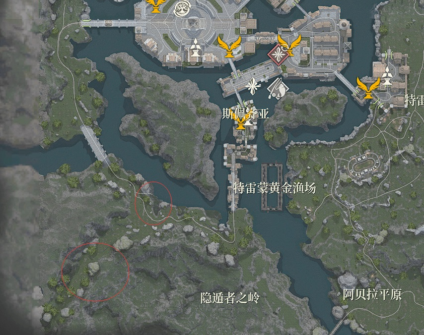
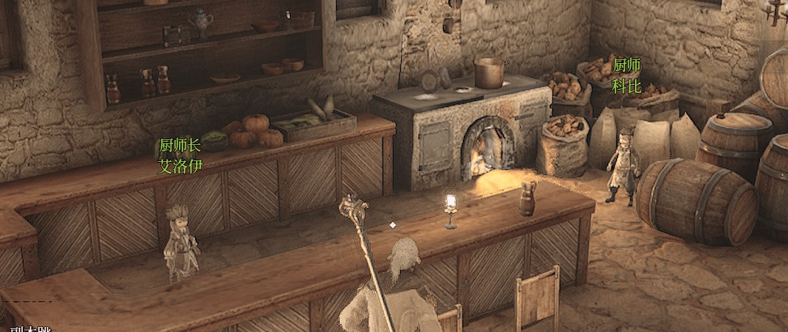
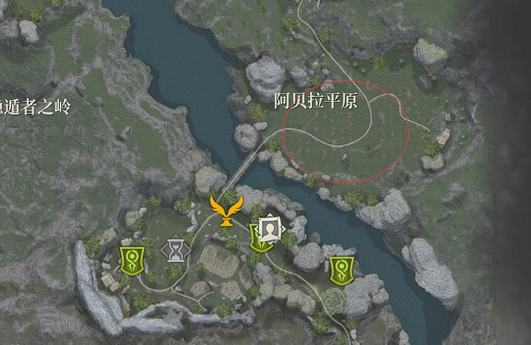

> 如何快速将料理职业提升到满级

&emsp;&emsp;制作芝士烤肉便当需要花费2个腥臭的肉，百分之百制作成功，制作一个可以获得15经验。

&emsp;&emsp;在杂货商人处可以购买腥臭的肉，24金币一个。

&emsp;&emsp;料理等级最高12级，共需要7w经验，~~通过制作芝士烤肉便当需要4667个，总计花费224016金币。~~

&emsp;&emsp;其中通过芝士烤肉便当最高可以升至10级满级，共3w经验值，需要烤肉便当2000个，总计花费96000金币。

&emsp;&emsp;需要注意的是，11级升到12级，非常多的制作是不给经验了，所以需要重新选择制作的物品，这里我们建议制作经济型三层烤肉郊游便当，需要两个优质的里脊和一个狐珠草，里脊1块钱一个，成本只有狐珠草 100星币/个成本较低。制作一个可以获得220经验，只需要制作182个就可以了。

> 料理等级进阶

### 如何领取料理的技工之路任务？

首先到达斯佩齐亚，然后在厨师科比处领取任务。

### 10级->11级

&emsp;&emsp;需要完成料理的技工之路 1-3

#### 技工之路1：收集草药和狐狸肉

&emsp;&emsp;在图片中的地点采集完材料之后，回到斯佩齐亚找厨师科比，他会给你一张配方

#### 技工之路2

&emsp;&emsp;从厨师科比处获取配方之后，制作料理，然后按照引导交给一个平民NPC就可以完成了。

#### 技工之路3-制作土豆浓汤

&emsp;&emsp;之后可以在厨师科比旁边的厨师长艾洛伊处接到任务。

&emsp;&emsp;然后去我们最熟悉的新手村狼王处找农场管理员，他会让你击杀盗贼，然后制作土豆浓汤，就可以完成任务了。

### 11级->12级

&emsp;&emsp;当你经验到达7w的时候，你仍然不是匠人，你需要完成任务，技工之路4，制作温馨的土豆浓汤（可能叫这个），同样的这个任务你要去新手村狼王那里找农场主。

#### 技工之路4 -制作温馨的土豆浓汤

&emsp;&emsp;在农场主处接到任务之后，只需要在获取平原小麦就可以完成任务，在阿贝拉平原，就在狼王附近。

### 小提示tips

&emsp;&emsp;如果不知道怎么晋升的话，点开esc，点开制作，选择你要晋升的职业，长按x即可完成晋升。

&emsp;&emsp;如果不能从厨师科比处接到任务的话，同上步骤

&emsp;&emsp;建议在联盟天赋中选择名人的专注力可以提升10%的制作熟练度，既可以省下时间，也可以节约成本。

